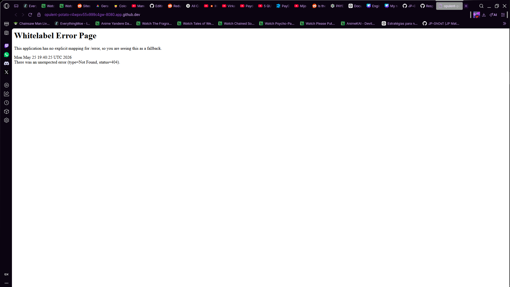
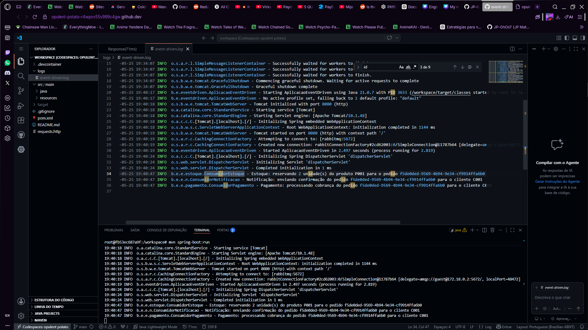
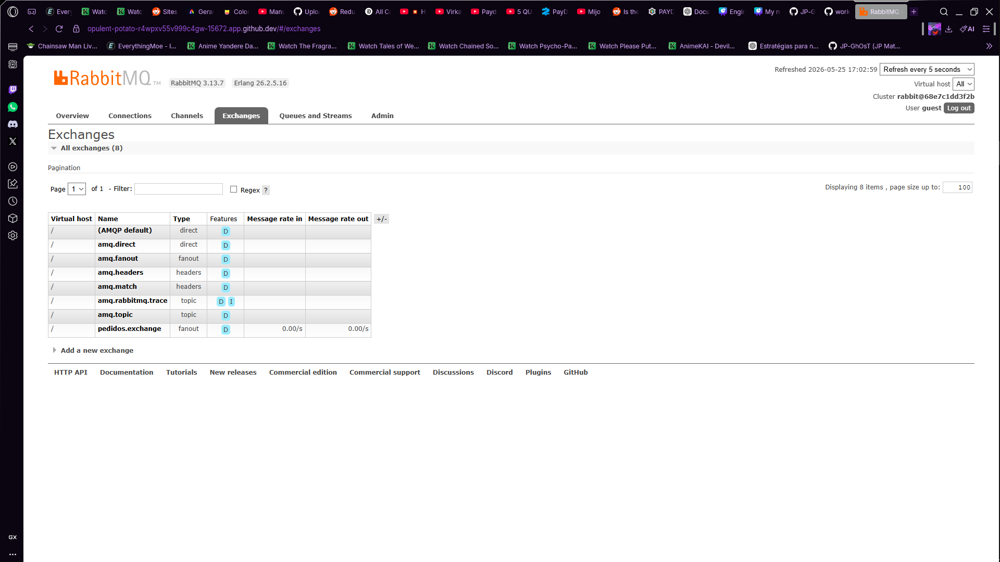
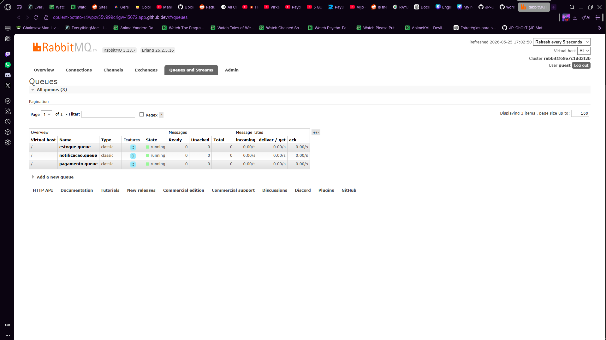

# Documentação — Event Driven Architecture

## Integrantes

- João Paulo Zimmermann Matsui - [GitHub](https://github.com/JP-GhOsT) | [Linkedin](https://linkedin.com/in/joaomatsui)

---

# Inicialização da Aplicação

## Evidência da aplicação iniciada

### Trecho do arquivo `event-driven.log`

```log
2026-05-25 19:33:33 INFO  b.e.eventdriven.AplicacaoEventDriven - Starting AplicacaoEventDriven using Java 21.0.7 with PID 977 (/workspace/target/classes started by root in /workspace)
2026-05-25 19:33:34 INFO  b.e.eventdriven.AplicacaoEventDriven - No active profile set, falling back to 1 default profile: "default"
2026-05-25 19:33:47 INFO  o.s.b.w.e.tomcat.TomcatWebServer - Tomcat initialized with port 8080 (http)
2026-05-25 19:33:47 INFO  o.a.catalina.core.StandardService - Starting service [Tomcat]
2026-05-25 19:33:47 INFO  o.a.catalina.core.StandardEngine - Starting Servlet engine: [Apache Tomcat/10.1.48]
2026-05-25 19:33:47 INFO  o.a.c.c.C.[Tomcat].[localhost].[/] - Initializing Spring embedded WebApplicationContext
2026-05-25 19:33:47 INFO  o.s.b.w.s.c.ServletWebServerApplicationContext - Root WebApplicationContext: initialization completed in 10761 ms
2026-05-25 19:33:51 INFO  o.s.b.w.e.tomcat.TomcatWebServer - Tomcat started on port 8080 (http) with context path '/'
2026-05-25 19:33:51 INFO  o.s.a.r.c.CachingConnectionFactory - Attempting to connect to: [rabbitmq:5672]
2026-05-25 19:33:52 INFO  o.s.a.r.c.CachingConnectionFactory - Created new connection: rabbitConnectionFactory#5922d3e9:0/SimpleConnection@6d6ac396 [delegate=amqp://guest@172.18.0.2:5672/, localPort=50042]
2026-05-25 19:33:53 INFO  b.e.eventdriven.AplicacaoEventDriven - Started AplicacaoEventDriven in 24.702 seconds (process running for 26.149)
2026-05-25 19:34:07 INFO  o.s.a.r.l.SimpleMessageListenerContainer - Waiting for workers to finish.
2026-05-25 19:34:07 INFO  o.s.a.r.l.SimpleMessageListenerContainer - Waiting for workers to finish.
2026-05-25 19:34:07 INFO  o.s.a.r.l.SimpleMessageListenerContainer - Waiting for workers to finish.
2026-05-25 19:34:07 INFO  o.s.a.r.l.SimpleMessageListenerContainer - Successfully waited for workers to finish.
2026-05-25 19:34:07 INFO  o.s.a.r.l.SimpleMessageListenerContainer - Successfully waited for workers to finish.
2026-05-25 19:34:07 INFO  o.s.a.r.l.SimpleMessageListenerContainer - Successfully waited for workers to finish.
2026-05-25 19:34:07 INFO  o.s.b.w.e.tomcat.GracefulShutdown - Commencing graceful shutdown. Waiting for active requests to complete
2026-05-25 19:34:07 INFO  o.s.b.w.e.tomcat.GracefulShutdown - Graceful shutdown complete
```

### Print da aplicação iniciada



---

# Teste do Endpoint POST /pedidos

## Requisição enviada

```http
POST http://localhost:8080/pedidos
Content-Type: application/json

{
  "idCliente": "C001",
  "idProduto": "P001",
  "quantidade": 2
}
```

## Resposta HTTP

```json
HTTP/1.1 202 
Content-Type: application/json
Transfer-Encoding: chunked
Date: Mon, 25 May 2026 19:40:47 GMT
Connection: close

{
  "message": "EventoPedidoCriado publicado com sucesso",
  "status": "EVENTO_PUBLICADO",
  "orderId": "f5de0ded-9569-4b94-9e34-cf9914ffa6b0",
  "idPedido": "f5de0ded-9569-4b94-9e34-cf9914ffa6b0",
  "mensagem": "EventoPedidoCriado publicado com sucesso"
}
```

### Print da resposta HTTP


---

# Processamento do Evento pelos Consumidores

## Evidência no `event-driven.log`

### Logs dos consumidores processando o mesmo pedido

```log
2026-05-25 19:40:47 INFO  b.e.e.estoque.ConsumidorEstoque - Estoque: reservando 2 unidade(s) do produto P001 para o pedido f5de0ded-9569-4b94-9e34-cf9914ffa6b0
2026-05-25 19:40:47 INFO  b.e.e.n.ConsumidorNotificacao - Notificação: enviando confirmação do pedido f5de0ded-9569-4b94-9e34-cf9914ffa6b0 para o cliente C001
2026-05-25 19:40:47 INFO  b.e.e.pagamento.ConsumidorPagamento - Pagamento: processando cobrança do pedido f5de0ded-9569-4b94-9e34-cf9914ffa6b0 para o cliente C001
```

### Print dos logs



---

# RabbitMQ

## Exchange e Filas

### Exchange utilizada

- `pedidos.exchange`

### Filas conectadas

- `estoque.queue`
- `pagamento.queue`
- `notificacao.queue`

### Evidência da interface RabbitMQ




---

# Publicação do Evento

## Evento publicado

### Nome do evento

- `EventoPedidoCriado`

### Arquivo onde o evento é publicado

```txt
ControladorPedido.java
```

### Método responsável pela publicação

```txt
criarPedido()
```

### Linha responsável pela publicação

```java
templateRabbit.convertAndSend(
    ConfiguracaoRabbitMQ.EXCHANGE_PEDIDOS,
    "",
    evento
);
```
---

# Consumidores do Evento

## Consumidores que recebem o evento

1. `ConsumidorEstoque`
2. `ConsumidorPagamento`
3. `ConsumidorNotificacao`

---

# Alteração no ConsumidorEstoque

## Regra implementada

> Descrever a alteração realizada no consumidor.

### Exemplo

```txt
Foi adicionada uma validação para pedidos com quantidade maior que 5.
```

---

## Evidência do teste com quantidade > 5

### Requisição utilizada

```json
{
  "cliente": "Maria",
  "produto": "Monitor",
  "quantidade": 10
}
```

### Resultado observado

```log
[INSERIR LOG OU RESULTADO AQUI]

Exemplo:
ConsumidorEstoque -> Quantidade acima do permitido para aprovação automática
```

### Print do teste

> Inserir print aqui

---

# Pergunta Final

## Por que o ControladorPedido não precisa conhecer os consumidores?

O `ControladorPedido` apenas publica um evento na exchange do RabbitMQ.  
Os consumidores ficam desacoplados da aplicação principal e recebem o evento de forma independente, permitindo maior escalabilidade, flexibilidade e baixo acoplamento entre os componentes do sistema.

---

# Conclusão

A arquitetura orientada a eventos permitiu que múltiplos consumidores processassem o mesmo evento de maneira independente utilizando RabbitMQ, demonstrando desacoplamento e comunicação assíncrona entre serviços.
